# Unity Toolset

Tools to improve the usage of Unity Editor.

## Attributes

### Wrappers

Sometimes you want to apply an attribute to an entire array or list, not on each element.
Replace the type with `ArrayWrapper<T>` or `ListWrapper<T>` to get that effect.

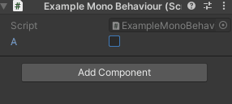

```cs
public sealed class ExampleMonoBehaviour : MonoBehaviour
{
    [SerializeField]
    private bool a;

    [SerializeField]
    [Indented(1)]
    [ShowIf(nameof(a))]
    private ArrayWrapper<int> b;
}
```

### Stackable and Custom Drawers

Unlike Unity drawers, the majority of this attributes support stack them with other attributes whenever the combination make sense.
This is possible thanks to a reimplementation of Unity drawers.
To create your custom drawers, inherit from `StackablePropertyDrawer` and decorate it with `CustomStackablePropertyDrawer`:

For example:
```cs
[CustomStackablePropertyDrawer(typeof(ReadOnlyAttribute))]
internal sealed class ReadOnlyDrawer : StackablePropertyDrawer
{
    protected internal override void BeforeOnGUI(ref Rect position, ref SerializedProperty property, ref GUIContent label, ref bool includeChildren, ref bool visible)
        => EditorGUI.BeginDisabledGroup(true);

    protected internal override void AfterOnGUI(Rect position, SerializedProperty property, GUIContent label, bool includeChildren, bool visible)
        => EditorGUI.EndDisabledGroup();
}
```

`CustomStackablePropertyDrawer` accept a type which must derive frmo `PropertyAttribute`. The attribute can be found either decorating a field or a serialized type.

#### Main Drawers
Some drawers requires major modifications in the inspector and so can't be stacked with other drawer that does the same.
Override the property `override bool RequestMain => true` for that.
If multiple main drawers are found in the same property, only the one with highest priority is considered main, which is informed by a callback to `override void IsMain(bool isMain)`.
Main drawers can override `void OnGUI(Rect position, SerializedProperty property, GUIContent label, bool includeChildren)` and `float GetPropertyHeight(SerializedProperty property, GUIContent label, bool includeChildren)` for more fine tunned behaviours.

### DrawTextureAttribute

Draw a texture on the field:

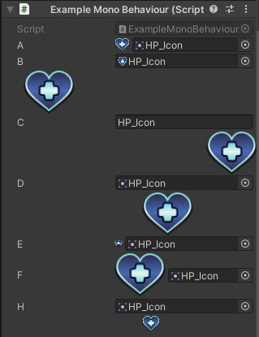

```cs
public sealed class ExampleMonoBehaviour : MonoBehaviour
{
    [SerializeField]
    [DrawTexture]
    private Sprite a;

    [SerializeField]
    [DrawTexture(DrawTextureMode.NewLineLeft)] // Set location of texture.
    private Texture2D b;

    [SerializeField]
    [DrawTexture(DrawTextureMode.NewLineRight)]
    private string c;

    [SerializeField]
    [DrawTexture(DrawTextureMode.NewLineCenter)]
    private Sprite d;

    [SerializeField]
    [DrawTexture(10)] // Set size of texture.
    private Sprite e;

    [SerializeField]
    [DrawTexture(100)]
    private Sprite f;

    [SerializeField]
    [DrawTexture(20, DrawTextureMode.NewLineCenter)]
    private Sprite h;
}
```

### DrawVectorRelativeToTransformAttribute

Draw in the scene a point that represent a `Vector2`, `Vector2Int`, `Vector3`, `Vector3Int`, `Vector4`, `Transform`'s position, `GameObject`'s position, `Component`'s position in the scene.
This point is relative to the position of the current MonoBehaviour's transform's position, or relative to the position of another (static/instance) field, property or method that returns any of the types above.
Additionally, it can be configured to show a dot or position handle, and a texture.

Finally, by holding key `Ctrl` you enable an Scene GUI window for better editing of this values.
This points and window can be disabled from scene menu configuration `Enderlook/Toolset/Draw Vector Relative To Transform/Enable Visualization` and `Enderlook/Toolset/Draw Vector Relative To Transform/Enable Scene GUI Editing`.

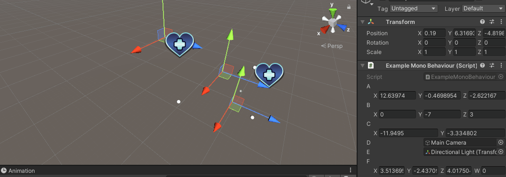

```cs
public sealed class ExampleMonoBehaviour : MonoBehaviour
{
    [SerializeField]
    [DrawVectorRelativeToTransform]
    private Vector3 a;

    [SerializeField]
    [DrawVectorRelativeToTransform(true)] // Replace position dot with position handle.
    private Vector3Int b;

    [SerializeField]
    [DrawVectorRelativeToTransform("HP_Icon")] // Show position dot and texture.
    private Vector2 c;

    [SerializeField]
    [DrawVectorRelativeToTransform("HP_Icon", true)] // Show position handle and texture.
    private GameObject d;

    [SerializeField]
    private Component e;

    [SerializeField]
    [DrawVectorRelativeToTransform(reference: nameof(e))] // Show position dot and use as relative position the position of the transform of component `e` rather than the position of the transform of this component.
    private Vector4 f;
}
```

### EnableIfAttribute & ShowIfAttribute

Conditionally draw or enable an attribute based on the value of one or two (static/instance) fields, properties or return value of methods.

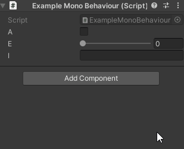

```cs
public sealed class ExampleMonoBehaviour : MonoBehaviour
{
    [SerializeField]
    private bool a;

    [SerializeField]
    [Indented]
    [ShowIf(nameof(a))] // Show if `a == true`.
    private bool b;

    [SerializeField]
    [Indented]
    [ShowIf(nameof(a))]
    private ArrayWrapper<bool> c;

    [SerializeField]
    [Indented]
    [ShowIf(nameof(b), chain: true)] // Show if `a == true && b == true`.
    private string d;

    [SerializeField]
    [Range(0, 1)]
    private float e;

    [SerializeField]
    [Indented]
    [ShowIf(nameof(e), .3f, ComparisonMode.GreaterOrEqual)] // Show if `e >= 0.3`.
    [Range(0, 1)]
    private float f;

    [SerializeField]
    [Indented(2)]
    [ShowIf(ComparisonMode.LessOrEqual, nameof(e), nameof(f))] // Show if `e <= f`.
    private string g;

    [SerializeField]
    [Indented]
    [ShowIf(nameof(Property))] // Show if `Property == true`.
    private ScriptableObject h;

    [SerializeField]
    [Indented(2)]
    [ShowIf(nameof(h))] // Show if `h != null`.
    private int j;

    private bool Property => a;

    [SerializeField]
    [ShowIf(nameof(Method))] // Show if `Method(true, new int[0]) == true`.
    private string i;

    private static bool Method(bool unused = true, params int[] unused2) => !Application.isPlaying;
}
```

### ExpandableAttribute

Allow to expand the content of a field.

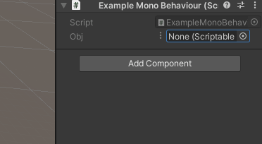

```cs
public sealed class ExampleMonoBehaviour : MonoBehaviour
{
    [SerializeField]
    [Expandable]
    private ScriptableObject obj;
}
```

Additionally, properties which derives from `UnityEngine.Object` has a new contextual menu named "Open in Window".

### IndentedAttribute

Applies an indentation to the property.

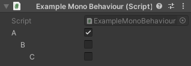

```cs
public sealed class ExampleMonoBehaviour : MonoBehaviour
{
    [SerializeField]
    private bool a;

    [SerializeField]
    [Indented]
    private bool b;

    [SerializeField]
    [Indented(2)]
    private bool c;
}
```

### InitOnlyAttribute

Becomes the property read-only in the inspector when the object is in an scene that is playing.

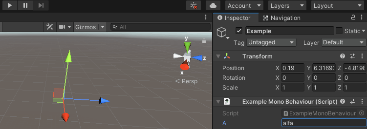

```cs
public sealed class ExampleMonoBehaviour : MonoBehaviour
{
    [SerializeField]
    [InitOnly]
    private string a;
}
```

### InlineAttribute

Inlines the content of a field in the inspector.

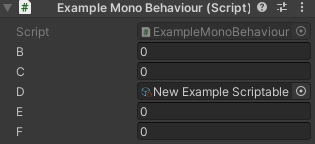

```cs
public sealed class ExampleMonoBehaviour : MonoBehaviour
{
    [SerializeField]
    [Inline]
    private ExampleClass a;

    [SerializeField]
    [Inline]
    private ScriptableObject b;
}

[Serializable]
public sealed class ExampleClass
{
    [SerializeField]
    private int b;

    [SerializeField]
    private int c;
}

[Serializable]
public sealed class ExampleScriptableObject : ScriptableObject
{
    [SerializeField]
    private int e;

    [SerializeField]
    private int f;
}
```

### IsPropertyAttribute

Normally, when if you serialize the backing field of an auto property, Unity provides a wrong name of it.
This attribute ensures the name is displayed correctly.

```cs
public sealed class ExampleMonoBehaviour : MonoBehaviour
{
    [field: SerializeField]
    [field: IsProperty]
    private int a { get; set; }
}
```

### LabelAttribute

Allow to replace the name and/or tooltip of a property, by either applying a direct value, or extracting it from an (static/instance) field, property or return method value.

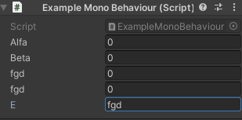

```cs
public sealed class ExampleMonoBehaviour : MonoBehaviour
{
    [SerializeField]
    [Label("Alfa")]
    private int a;

    [SerializeField]
    [Label("Beta", "Beta Tooltip")]
    private int b;

    [SerializeField]
    [Label(nameof(e), LabelMode.ByReference)]
    private int c;

    [SerializeField]
    [Label(nameof(e), LabelMode.ByReference, nameof(F), LabelMode.ByReference)]
    private int d;

    [SerializeField]
    private string e;

    private string F => $"Description: {e}";
}
```

### LayerAttribute

Show a layer inspector. This attribute is valid on fields of type `sbyte`, `byte`, `short`, `ushort`, `int`, `uint`, `long`, `ulong`, `float`, `double`, `decimal`, `string`, `LayerMask`, 

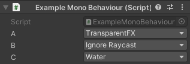

```cs
public sealed class ExampleMonoBehaviour : MonoBehaviour
{
    [SerializeField]
    [Layer]
    private string a;

    [SerializeField]
    [Layer]
    private byte b;

    [SerializeField]
    [Layer]
    private LayerMask c;
}
```

### ReadOnlyAttribute

Mark a property as read-only in the inspector.

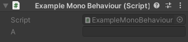

```cs
public sealed class ExampleMonoBehaviour : MonoBehaviour
{
    [SerializeField]
    [ReadOnly]
    private string a;
}
```

### RedirectToAttribute

This attribute is not applied on a property but rather on a type. This allow to hide the type itself an only draw a field of it.

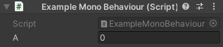

```cs
public sealed class ExampleMonoBehaviour : MonoBehaviour
{
    [SerializeField]
    private Example a;
}

[RedirectTo(nameof(b))]
[Serializable]
public sealed class Example
{
    [SerializeField]
    private int b;

    [SerializeField]
    private int c;
}
```

### RestrictTypeAttribute

Restrict the allowed types that can be assigned to a field. Only objects which inherit/implement the specified types are allowed.

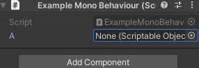

```cs
public sealed class ExampleMonoBehaviour : MonoBehaviour
{
    [SerializeField]
    [RestrictType(typeof(IExample1), typeof(IExample2))]
    private ScriptableObject a;
}

public sealed class ExampleScriptableObject1 : ScriptableObject, IExample1, IExample2
{
    [SerializeField]
    private int A;
}

public sealed class ExampleScriptableObject2 : ScriptableObject, IExample1
{
    [SerializeField]
    private string A;
}

public sealed class ExampleScriptableObject3 : ScriptableObject
{
    [SerializeField]
    private MonoBehaviour A;
}
```

### PropertyPopupAttribute & PropertyPopupOptions

Creates a switch button to change the representation of a field between several nested fields.

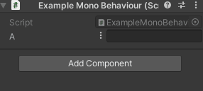

```cs
public sealed class ExampleMonoBehaviour : MonoBehaviour
{
    [SerializeField]
    private Example a;
}

[Serializable]
[PropertyPopup(nameof(a))]
public struct Example
{
    [SerializeField]
    private ExampleEnumeration a; // Support any data type by comparing using `EqualityComparer<T>.Default`.
                                  // Value can be extracted from (static/instance) fields, properties or return method values.

    [SerializeField]
    [PropertyPopupOption(ExampleEnumeration.Alfa)] // Show if `a == ExampleEnumeration.Alfa`.
    private string b;

    [SerializeField]
    [PropertyPopupOption(ExampleEnumeration.Beta)] // Show if `a == ExampleEnumeration.Beta`.
    [Range(0, 1)]
    private float c;

    [SerializeField]
    [PropertyPopupOption(ExampleEnumeration.Gamma)] // Show if `a == ExampleEnumeration.Gamma`.
    private LayerMask d;

    private enum ExampleEnumeration
    {
        Alfa,
        Beta,
        Gamma
    }
}
```

## Windows

### Open in Window

Already explained in the `ExpandableAttribute` section. Allow to extract a property from the inspector and show it in a separate window.

### Object Menu

A menu designed to edit, select or create asset and assign them to properties.


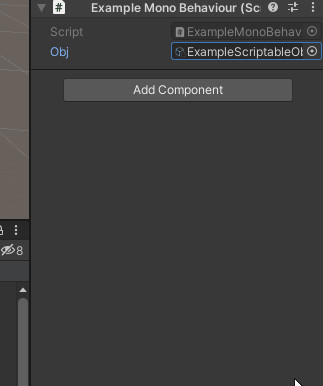

## Context Menu

### Extract Sub-Asset

Extracts a sub asset from another asset.

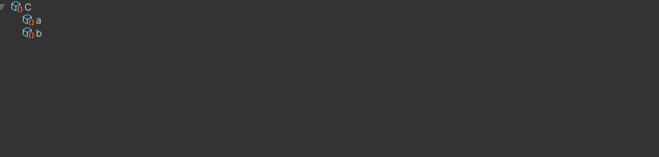

## Additional APIs

This library has helper methods for writing editors.

**TODO:** Write them in README.